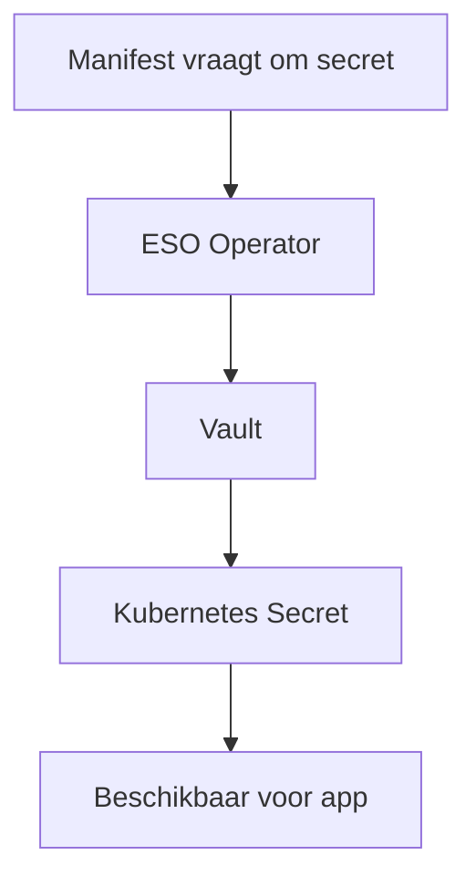

Ik was eigenlijk van plan om aan de slag te gaan met identity management in laag 3 (denk aan **LDAP** en aanverwanten), maar het liep anders. Ook in laag 2 kom je identities en vooral **secrets** tegen: wachtwoorden, API-keys, noem maar op. Veel componenten zijn hiervan afhankelijk.

> *Meer weten over het laagmodel? Zie [De cloud als gelaagde omgeving](https://mysite.prjv.nl/article/mprjv65/de_cloud_als_gelaagde_omgeving){target="_blank"}.* 

Het is verleidelijk om deze secrets gewoon in je YAML-manifesten te zetten waarmee je een service definieert. Maar dat is allesbehalve best practice. Iedereen met shell-toegang tot je cluster kan ze dan lezen. Dat is al niet wenselijk, maar het wordt echt riskant als je deze configuratie in een git-repository zet en – gruwel – gaat delen. Ik ben me heel bewust van dat risico, en toch is het me al een paar keer overkomen.

## Kubernetes secrets: wel veilig?

Kubernetes biedt een oplossing: je kunt **secrets** als aparte resources aanmaken in het cluster, die je vervolgens gebruikt bij de inrichting van een dienst. Dit doe je met YAML-bestanden, maar let op:

- De secrets staan daarin in *cleartext* of *base64-encoded*.
- **Base64 is géén beveiliging**; iedereen kan het decoderen.
- Zulke YAML-bestanden wil je dus niet in een online repository hebben.
- Voeg ze toe aan je `.gitignore`.

Zelf gebruik ik GitHub soms als back-up, maar dat werkt dus niet voor deze bestanden. Zorg daarom voor een **veilige, offline back-up** van je secrets-bestanden.

## Vault: centrale opslag van secrets

Tot zover is het niet heel complex. Maar het kan geavanceerder: met een **vault**. Een vault is een dienst waarin je secrets veilig opslaat en via policies bepaalt wie toegang heeft tot welk secret. Er zijn meerdere implementaties; ik heb gewerkt met [**HashiCorp Vault**](https://www.hashicorp.com/en/products/vault){target="_blank"}.

In hoofdlijnen werkt het zo:

1. In Kubernetes beschrijf je welk secret je nodig hebt.
2. Een aparte dienst – de [**External Secrets Operator (ESO)**](https://external-secrets.io/latest/){target="_blank"} – haalt het op uit de vault.
3. ESO maakt er een Kubernetes secret van.

Zo kun je centraal en veilig je secrets beheren.

## Praktijkervaring: waar het misging

In de praktijk liep ik echter vast op de ESO: die vereist een zogeheten **CRD** (Custom Resource Definition), en ik kreeg geen enkele CRD werkend met mijn ESO-implementatie. Na veel proberen heb ik het voorlopig opgegeven.

## Conclusie

Voor nu ga ik dus verder met het direct aanmaken van secrets in Kubernetes via YAML-bestanden. Misschien waag ik in de toekomst nog een poging om alles centraal in een vault te beheren, maar op dit moment wil ik vooral dóór.